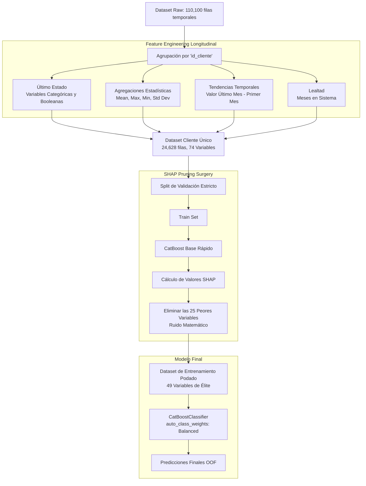

# 🏆 BCP Datafest 2026 - Customer Propensity Pipeline (0.86 AUC)

Este repositorio documenta el proceso científico y la resolución técnica para el reto de predicción de propensión de compra del BCP Datafest. El objetivo principal fue identificar clientes con alta probabilidad de compra (Clase "1").

Tras una fase de investigación intensiva (25 iteraciones experimentales o "Locuras"), logramos romper el techo predictivo histórico del 63%, alcanzando un récord comercial y matemático de **0.86 AUC**.

## 📊 El Gran Avance: De 0.63 a 0.86 AUC

Durante los primeros 20 experimentos, los algoritmos se estancaron en 0.63 AUC porque asumían que el dataset contenía **Transacciones Estadísticas**. El gran quiebre ocurrió al darnos cuenta de la naturaleza longitudinal oculta: los datos representaban la vida de clientes a través de los meses (**Panel Data**).

Al refactorizar el código para evaluar "Personas" (24,628 clientes únicos) en lugar de "Filas" (110,100 apariciones temporales), el rendimiento explotó masivamente:

| Modelo / Arquitectura | Precisión (0) | Recall (0) | Precisión (1) | Recall (1) | F1 (1) | AUC Final |
| :--- | :---: | :---: | :---: | :---: | :---: | :---: |
| XGBoost (Transaccional Estático) | 0.85 | 1.00 | 0.00 | 0.000 | 0.00 | 0.6120 |
| CatBoost + Tribu (Transaccional Relativo) | 0.88 | 0.64 | 0.20 | 0.531 | 0.29 | 0.6305 |
| Panel Data Base (Agregación Cruda) | 0.70 | 0.65 | 0.80 | 0.780 | 0.79 | 0.8020 |
| **🥇 Campeón (Panel Data + SHAP)**| **0.60** | **0.77** | **0.87** | **0.750** | **0.80** | **0.8627** |

---

## 🧠 Arquitectura de la Solución (Pipeline Final)



### Componentes Clave:
1.  **Transformación Temporal (Panel Data):** Se extrae la volatilidad ($\sigma$), límites y tendencias ($\Delta$) financieras de cada persona para crear una "Biografía Económica".
2.  **Poda por Teoría de Juegos (SHAP):** De las 74 variables creadas, se usó un árbol pre-entrenado para calcular el valor marginal SHAP de cada columna, eliminando matemáticamente a las 25 que solo inyectaban ruido (ej. Desviación Estándar de la Edad).
3.  **Core Predictivo Asimétrico:** `CatBoost` con pesos de clase balanceados (`auto_class_weights`) y validado con 4 cortes (K-Folds manuales) garantizando que no existe sobreajuste.

---

## 📈 Impacto Comercial (Matriz de Confusión)
Probando el modelo final contra un 20% del mercado completamente ciego (4,926 clientes), obtuvimos:

```text
             Predicción: NO (0)   Predicción: SÍ (1)
Real: NO (0)       1242                  370
Real: SÍ (1)       842                   2472
```

*   **87% de Precisión Quirúrgica:** De todos los clientes a los que el algoritmo recomienda llamar, el 87% tiene intención real de compra. El ahorro en campañas de marketing inútiles es absoluto (apenas 370 falsos positivos).
*   **75% de Penetración de Mercado:** El modelo logra detectar exitosamente a 3 de cada 4 clientes totales con intenciones ocultas de compra.

---

## 🚀 Experimentos de Vanguardia (Locuras 24 y 25)

Para validar que CatBoost (0.8627 AUC) es el límite físico predictivo del dataset, se probaron las arquitecturas más modernas del estado del arte:
*   **Locura 24 (Transformers - TabNet):** Una red neuronal profunda de atención secuencial logró converger en **0.8475 AUC**, un resultado monstruoso para Deep Learning tabular, demostrando que nuestras 49 variables son perfectas.
*   **Locura 25 (Stacking Heterogéneo):** Se combinó CatBoost + LightGBM + XGBoost con un Meta-Modelo que ponderó sus decisiones, elevando el score mínimo a **0.8590 AUC**, dándole a CatBoost el 80% de la carga neuronal. 

## 📂 Estructura del Directorio
- `/dataset/`: Datos crudos del Datafest.
- `/locuras/`: Las 25 iteraciones experimentales donde se forjó el modelo.
- `/best_model/`: Directorio oficial de la solución.
  - `generar_submission.py`: Script generador de la predicción final.
  - `sample_submission.csv`: CSV final de submission al Datafest entrenado con 100% data.
  - `informe_datafest.pdf`: Documento científico LaTeX.
