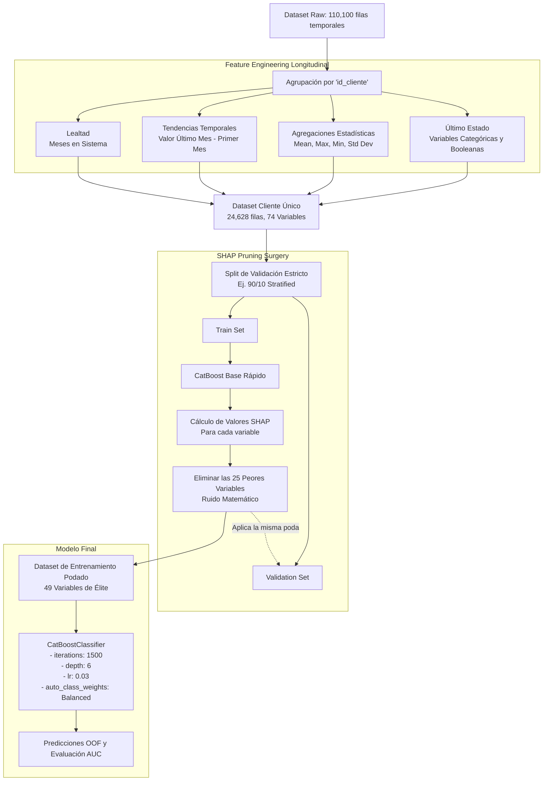

# Arquitectura del Modelo Ganador: "Customer Propensity Pipeline"

La solución final que alcanzó el **0.86 AUC** abandona la predicción puramente estática para adoptar una arquitectura de **Agregación Longitudinal** complementada con un **Bisturí de Explicabilidad (SHAP)**.

A continuación, se detalla la arquitectura completa de extremo a extremo:

## Diagrama de Flujo (Mermaid)

## Componentes de la Arquitectura

### 1. Transformación Longitudinal (Panel Data to Static)
En lugar de tratar cada aparición mensual de un cliente como un dato independiente (lo cual genera un "data leakage" colosal en la validación), comprimimos todo el historial de la persona en una sola fila. El espacio muestral pasa de `N = 110,100` a `N = 24,628`.

### 2. Extracción de Metadatos Financieros (74 Features)
Para compensar la compresión temporal, extrajimos la "película" completa del cliente:
*   **Volatilidad:** Calculando la Desviación Estándar (`std`) de su `ratio_deuda_ingresos` o `saldo_promedio`.
*   **Límites:** Analizando los picos (`max`, `min`) de sus movimientos.
*   **Tracción Temporal:** Restando los valores de su último mes frente a los de su primer mes para calcular la tendencia (`trend`).
*   **Fidelidad:** Contando la suma de meses de interacción.

### 3. SHAP Pruning (El "Cirujano")
La creación masiva de agregaciones genera ruido inevitable. En lugar de usar métodos de selección globales o estadísticos (como ANOVA o Gain global), usamos Teoría de Juegos a través de **SHAP (SHapley Additive exPlanations)**.
El algoritmo entrena un modelo rápido sobre el Train set, evalúa matemáticamente el impacto marginal de cada variable en las decisiones finales del árbol, y **elimina las 25 variables menos determinantes** (ej. Desviaciones estándar de visitas web o edades promedio).

### 4. El Corazón Predictivo (CatBoost)
El motor final es un ensamblado de árboles por Boosting de Gradiente (`CatBoostClassifier`).
*   **Manejo Categórico:** Se le delega el manejo nativo de las variables de texto (Ordered Target Encoding) para evitar sesgos de filtración.
*   **Balanceo Interno:** Dado que al limpiar la base los "ceros" pasaron a ser la minoría (aprox 8,000 contra 16,000 "unos"), el algoritmo balancea los pesos de la función de pérdida (`auto_class_weights='Balanced'`).
*   **Prevención de Overfitting:** Tasa de aprendizaje baja (`0.03`), profundidad restringida (`depth=6`) y detención temprana (`early_stopping_rounds=50`).
